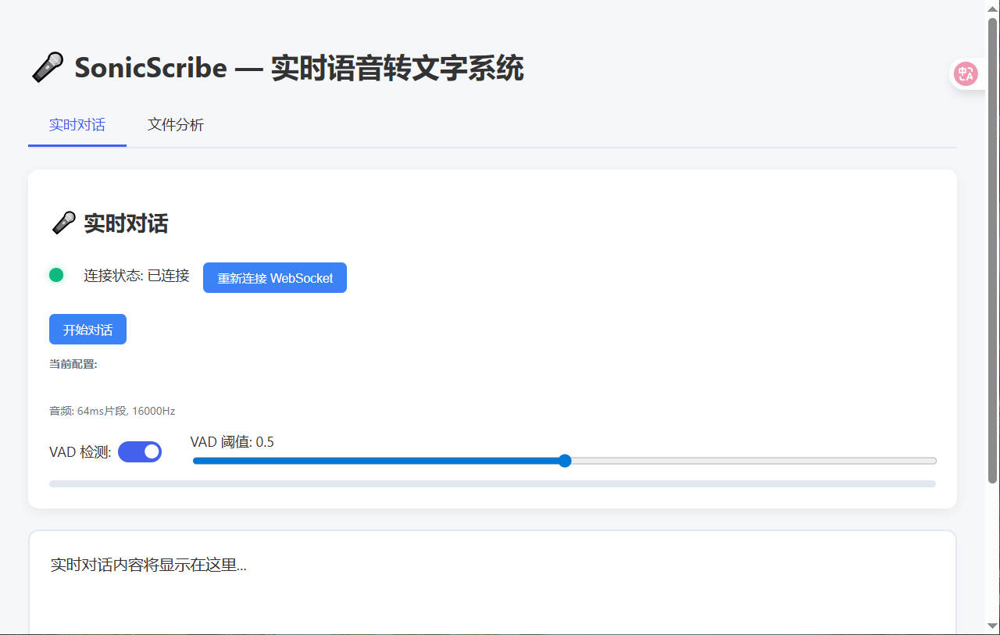

# SonicScribe — 实时语音转文字系统

[](LICENSE)
[](https://www.python.org/)
[](https://nodejs.org/)

> 🔊 基于 [GLM-ASR-Nano-2512](https://huggingface.co/zai-org/GLM-ASR-Nano-2512) 的实时语音识别系统，支持实时对话与文件上传两种模式。

---

## 🌐 Language Versions

- [中文版 README](README.md)
- [English version README](README-en.md)

---

## 🧩 项目概述

SonicScribe 是一个基于 **GLM-ASR-Nano-2512** 模型的 Web 原生实时语音转文字系统，采用前后端分离架构，支持低延迟、高准确率的语音识别服务。适用于会议记录、讲座整理、访谈笔记、日常对话等多种场景。

系统提供两种核心模式：
- **实时对话**：麦克风实时录音，边说边转文字，支持人声检测与状态指示。
- **文件分析**：上传音频文件（支持 WAV、MP3、FLAC 等格式），系统自动转换并流式输出分段结果。

---

## 🚀 快速开始

### 前置要求
- Python 3.8+
- Node.js 18+
- `git`, `pip`, `npm`

### 安装与配置

```bash
# 1. 克隆项目
git clone https://github.com/gengyuchao/SonicScribe.git
cd SonicScribe

# 2. 安装后端依赖
cd backend
python -m venv venv
source venv/bin/activate   # Linux/Mac
# 或：venv\Scripts\activate  # Windows
pip install -r requirements.txt
cp .env_template .env

# 3. 安装前端依赖
cd ../frontend
npm install
cp .env_template .env

# 4. 下载语音识别模型
# 访问：https://huggingface.co/zai-org/GLM-ASR-Nano-2512
# 下载后放入：backend/models/GLM-ASR-Nano-2512
```

### 启动服务

```bash
# 启动后端服务
cd backend
python main.py

# 启动前端开发服务器
cd ../frontend
npm run dev -- --port 8080
```

> 🌐 打开浏览器访问 `http://localhost:8080` 即可使用。


---

## 📌 使用说明

### 实时对话
1. 进入 **“实时对话”** 标签页。
2. 点击 **“开始录音”**，允许麦克风权限。
3. 开始说话，系统将实时显示转录结果。
4. 点击 **“停止”** 结束录音，查看完整文本。

### 文件转录
1. 进入 **“文件分析”** 标签页。
2. 点击 **“选择文件”**，上传音频文件（支持 MP3、WAV、FLAC、M4A、OGG、WebM 等）。
3. 点击 **“开始转录”**，系统将自动处理并实时显示进度。
4. 转录完成后，可查看完整文本、时间戳与统计信息。

---

## ⚙️ 系统架构

### 实时处理流程
1. 音频数据以 **64ms** 为单位分片。
2. 通过 **WebSocket** 实时传输至后端。
3. 后端执行 **语音活动检测（VAD）**，过滤静音段。
4. 语音段最长为 **20 秒**（可配置），自动拆分超长音频。
5. 结果分两阶段返回：
   - **临时结果**：每秒生成一次，用于实时预览。
   - **最终结果**：语音段结束时确认并输出。

### 音频预处理
- 支持格式：WAV、MP3、FLAC、M4A、OGG、WebM。
- 自动转换为 **16kHz 单声道 PCM** 格式。
- 输入标准化为浮点型 `[1, N]` 格式，确保模型输入一致性。

### 模型与加速
- 使用 **GLM-ASR-Nano-2512** 模型，支持中文普通话与英文识别。
- 推荐使用 GPU（CUDA）加速，显著提升处理速度。
- 可通过 `DEVICE=cuda` 在环境变量中启用。

---

## 📋 配置说明

复制前后端的 `.env_template` 为 `.env` 并根据需求修改：

| 变量 | 默认值 | 说明 |
|------|--------|------|
| `HOST` | `0.0.0.0` | 服务绑定地址 |
| `PORT` | `8000` | 服务端口 |
| `DEVICE` | `cuda` | 使用 `cuda` 启用 GPU 加速（推荐） |
| `VAD_SPEECH_THRESHOLD` | `0.6` | VAD 语音检测阈值（越低越敏感） |
| `MAX_SEGMENT_DURATION` | `20.0` | 单个语音段最大持续时间（秒） |

> 💡 建议使用 GPU（至少 6GB 显存）以获得最佳性能。

> 💡 注意前后端的端口设计端口不同，请根据实际应用设置。

---

## 📦 项目限制

- 支持音频格式：WAV、MP3、FLAC、M4A、OGG、WebM。
- 浏览器支持：需支持 Web Audio API 与 WebSocket 的现代浏览器（Chrome、Firefox、Edge）。

## 🔐 SSL 证书生成

项目已提供便捷脚本用于生成自签名 SSL 证书：

1. 进入证书目录：
   ```bash
   cd certs
   ```

2. 执行生成脚本：
   ```bash
   chmod +x generate_cert.sh
   ./generate_cert.sh
   ```

3. 生成的文件包括：
   - `cert.pem` - 证书文件
   - `key.pem` - 私钥文件

4. 使用说明：
   - 自签名证书需要在浏览器中手动信任
   - 生产环境请使用 Let's Encrypt 或商业证书

---

## 📚 贡献指南

我们欢迎社区贡献！请按以下流程提交：
1. Fork 本仓库。
2. 创建功能分支：`git checkout -b feature/new-feature`。
3. 提交更改：`git commit -m '添加新功能'`。
4. 推送至远程：`git push origin feature/new-feature`。
5. 提交 Pull Request。

---

## 📜 许可证

This project is licensed under the Apache License, Version 2.0 - see the [LICENSE](LICENSE) file for details.

---

## 🙏 致谢

- [GLM-ASR-Nano-2512](https://huggingface.co/zai-org/GLM-ASR-Nano-2512) — 高效中文语音识别模型。
- [Silero VAD](https://github.com/snakers4/silero-vad) — 稳定的语音活动检测技术。

---

> ✅ 专为开发者设计，用于实时语音处理。  
> 🚀 开始你的语音转文字之旅 — 点击开始！
